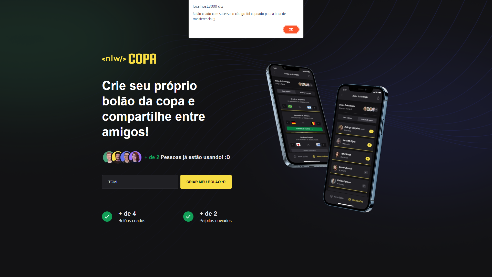
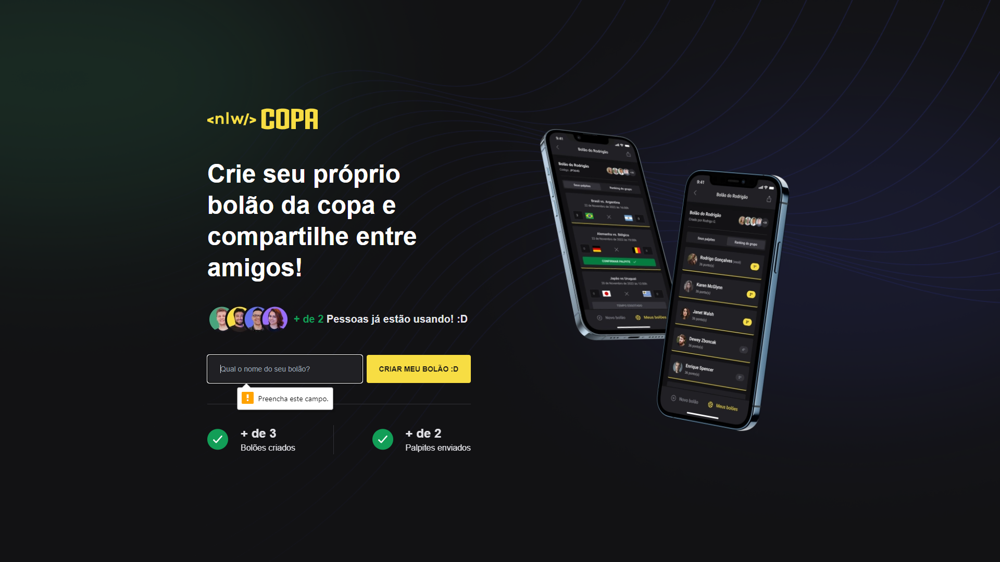

# Bolao da Copa

 
   

<h4 align="center" >🚀 🟪 Next Level Week - Copa 2022 🟪 🚀</h4>

<h4 align="center"> Application developed during a Full Stack Event, the <a style="color: #8a4af3;" href="https://github.com/topics/next-level-week">Next Level Week #10</a> promoted by <a style="color: #8a4af3;" href="https://www.rocketseat.com.br/">@Rocketseat</a></h4>

#
 

#

  |&nbsp;&nbsp;
  <a style="color: #8a4af3;" href="#project">Project</a>&nbsp;&nbsp;&nbsp;|&nbsp;&nbsp;&nbsp;
  <a style="color: #8a4af3;" href="#techs">Technologies</a>&nbsp;&nbsp;&nbsp;|&nbsp;&nbsp;&nbsp;
  <a style="color: #8a4af3;" href="#app">Site</a>&nbsp;&nbsp;&nbsp;|&nbsp;&nbsp;
  <a style="color: #8a4af3;" href="#run-project">Run</a>&nbsp;&nbsp;&nbsp;|&nbsp;&nbsp;
  <a style="color: #8a4af3;" href="#author">Author</a>&nbsp;&nbsp;&nbsp;|&nbsp;&nbsp;&nbsp;

#

<h1 align="center">
  
  

  

  

  

</h1>

 

<h2>  | :artificial_satellite: About:  </h2>

  This app is part of a full stack project with a mobile version and global API. You can create a betting group about the 2022 Qatar Soccer Wolrd Cup 🏆 and invite your friends to bet with you! :D

  This application is a landing page, is a page that has all elements to convert your visitor into a Lead or client oportunity. Here he can have a overveiw about the aplication and a call to action (create a betting group)

- Site: <a  style="color: #8a4af3;" href="https://bolao-da-copa-xi.vercel.app/">Bolão da Copa - landing page</a> 

> 

 - Repo: [Backend] - <a style="color: #8a4af3;" href="https://github.com/Samuel-Ricardo/bolao-da-copa_api">Bolão Da Copa - [API]</a>
 - Repo: [Mobile] - <a style="color: #8a4af3;" href="https://github.com/Samuel-Ricardo/bolao-da-copa_mobile">Bolão Da Copa - [Mobile]</a>
  
   

- This Site is hosted on <a style="color: #8a4af3;" href='https://vercel.com/'> Vercel </a> 
- Current Version: <b> 1.0.0 </b>

#

<h2 id="techs">
  :building_construction: | Technologies and Concepts Studied:
</h2>

  - ReactJS
  - NextJS
  - TailwindCSS
  - JavaScript
  - TypeScript
  - TSX
  - Axios
  - Consume API
  - Clean Code
  - Asynchronous Functions 
  - Google Fonts 
  - HTML
  - CSS
  - Deploy

  > Among Others...

#

<h2 id="app">
  💻 | Application:
</h2>

> 
- This Site is hosted on <a style="color: #8a4af3;" href='https://vercel.com/'> Vercel </a> 
- Current Version: <b style="color: #8a4af3;"> 1.0.0 </b>

#
